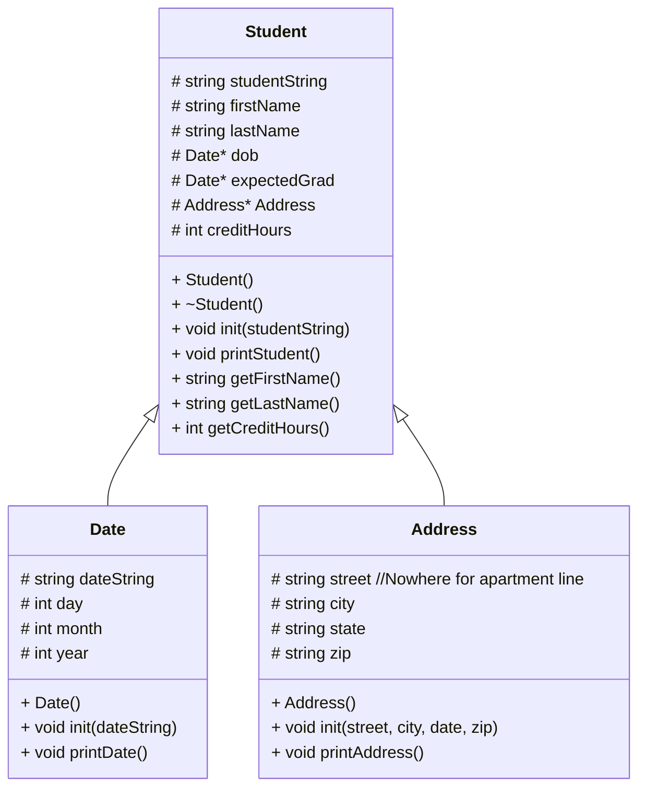

# heapOfStudents

# UML

```mermaid
classDiagram
        Student <|-- Date
        Student <|-- Address
    class Student{
        # string studentString
        # string firstName
        # string lastName
        # Date* dob
        # Date* expectedGrad
        # Address* Address
        # int creditHours
        + Student()
        + ~Student()
        + void init(studentString)
        + void printStudent()
        + string getFirstName()
        + string getLastName()
        + int getCreditHours()
    }
    class Date {
        # string dateString
        # int day
        # int month
        # int year
        + Date()
        + void init(dateString)
        + void printDate()
    }
    class Address{
        # string street //Nowhere for apartment line
        # string city
        # string state
        # string zip
        + Address()
        + void init(street, city, date, zip)
        + void printAddress()
    }
```