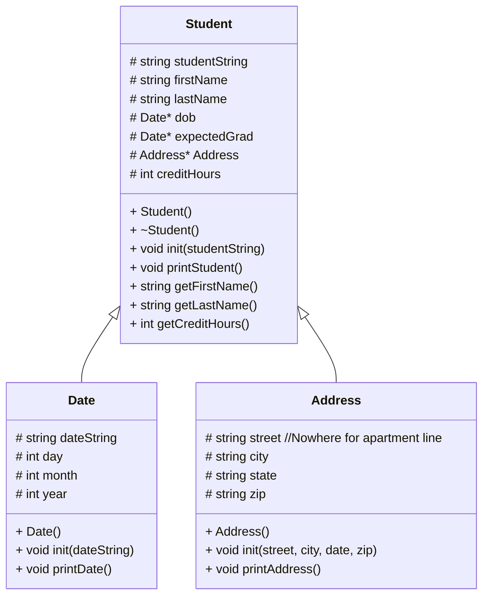

# heapOfStudents

# UML

# Algorithms

## Main

## Student Class

class Student():
    protected:
    string studentString
    string firstName
    string lastName
    Date* dob
    Date* expectedGrad
    Address* Address
    int creditHours

    public:
    Student()
        Student constructor
    ~Student()
        Student deconstructor
    void init(studentString)
        Bring in the string of student information
        Assign values to the first and last name strings
    void printStudent()
       Print the student first and last name
       Print the student's date of birth from the dob date class
       Print the student's address from the address class
       Print the student's expected graduation from the graduation date class
       Print the student's current credit hours
    string getFirstName()
        Get the first name from student string
        Assign the first name to the first name variable
    string getLastName()
        Get the last name from the student string
        Assign the last name to the last name variable
    int getCreditHours()
        Assign a value to the credit hours int

## Address Class
    protected:
    string street //Nowhere for apartment line
    string city
    string state
    string zip

    public:
    Address()
        Address constructor
    void init(street, city, date, zip)
        Assign each component to related variable
    void printAddress()
        print full address using all string variables

## Date Class
    protected:
    string dateString
    int day 
    int month
    int year

    public:
    Date()
        constructor
    void init(dateString)
        assign values to the variables day, month, and year
    void printDate()
        print the assigned values